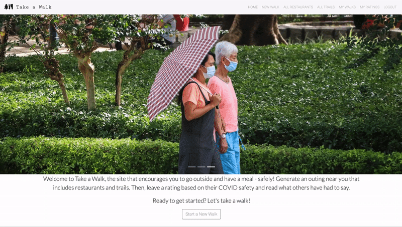
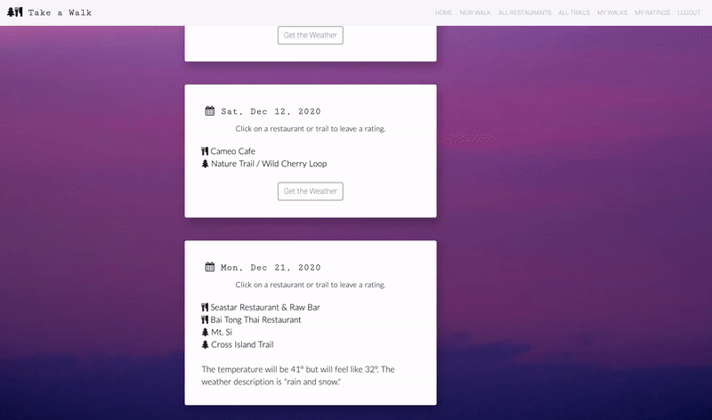
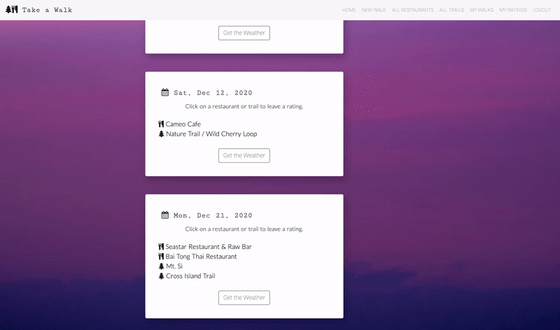
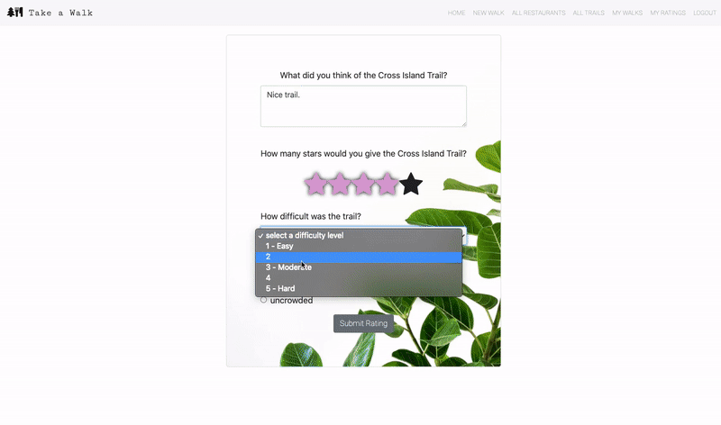

Welcome to Take a Walk! 

This app allows a user to generate nearby restaurants and trails for an outing and leave reviews on how COVID-safe they were. 

Backend:
- Flask
- SQLAlchemy 
- PostgreSQL 

Frontend:
- React 

Styling:
- React Bootstrap 

APIs:
- Yelp Fusion API 
- Hiking Project API 
- Open Weather Map API

The app allows the user to register for an account and login. 

To start a new walk, the user clicks the button on the homepage or in the navigation bar. The user is prompted for the zipcode for where they'd like to walk and the date they'd like to go.

Restaurants and trails are generated via fetch requests to the Hiking Project and Yelp Fusion APIs, respectively. When the user submits their choices, the app routes to the Saved Walks component, which sends a fetch request to the server to display all of the walks for the user sorted by date. 

The app also generates the weather for each walk based on the date and location via a fetch request to the Open Weather Map API. 

On the Saved Walks component, the user can rate the restaurants and trails by clicking on their names. The Restaurant Rating and Trail Rating components prompt the user for information related to COVID safety. 

Both rating components route to the User Ratings component upon submission, which displays all ratings submitted by this user. 

